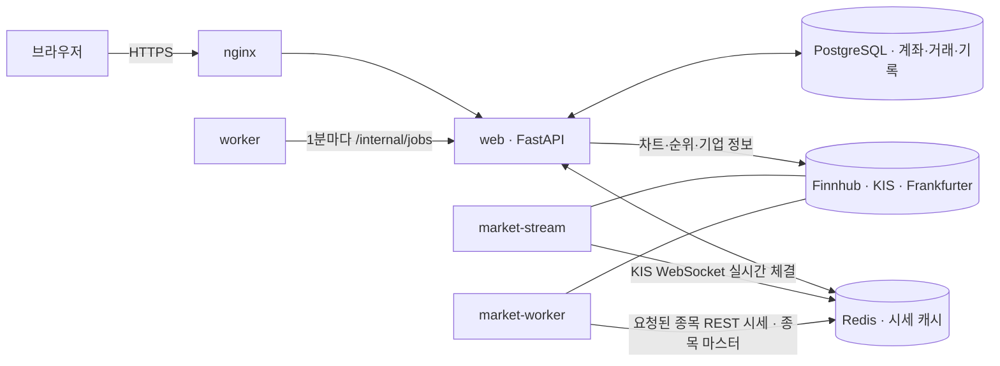

# ALPHARENA

한국·미국 주식과 채권·금 ETF를 실제 시세로 연습 거래하는 **웹 기반 모의투자 서비스**입니다.
모든 자산은 가상이며, 실제 돈이나 증권은 거래되지 않습니다. 시세 공급자 API는 조회 전용으로만 사용합니다.

- 백엔드: Python 3.12 · FastAPI · SQLAlchemy · PostgreSQL 17 · Redis 7
- 프론트엔드: 빌드 과정 없는 HTML / CSS / JavaScript (`app/static`)
- 배포: Docker Compose + nginx (선택적으로 Let's Encrypt HTTPS)

## 주요 기능

### 거래
- **USD·KRW 이중 지갑**: 가입 시 USD 지갑에 초기 자금(기본 $100,000)이 지급됩니다. 미국 종목은 USD, 국내 종목은 KRW로 결제합니다.
- **바로 주문 (모의 시장가)**: 최신 시세가 있으면 즉시 체결합니다. 시세가 오래됐거나 장이 닫혀 있으면 거절합니다. 조건을 걸어 두려면 아래 예약 주문을 씁니다.
  - 한국: 프리장(NXT 상장 종목)·정규장·애프터장(ETF·ETN 제외)에서 주문 가능([한국 세션과 시세](#한국-세션과-시세))
  - 미국: 데이마켓·프리장·정규장·애프터장에서 주문 가능([미국 세션과 시세](#미국-세션과-시세))
  - 어느 시장이든 현재 세션의 체결가가 확인된 경우에만 체결합니다.
- **예약 주문**: 조건 가격과 방향을 정해 두면 조건에 닿을 때 장 운영 시간에 시장가로 체결합니다(워커가 약 1분마다 확인).
  - 매수: 가격 이하일 때(지정가) · 가격 이상일 때(돌파) / 매도: 가격 이상일 때(익절) · 가격 이하일 때(손절)
  - 잔액·보유 수량은 체결 시점에 다시 확인하고, 부족하면 거절로 표시합니다. 대기 중인 예약은 최대 20개이며 종목 화면과 거래내역에서 취소할 수 있습니다.
- **수수료·세금 (토스증권 기준)**: 미국 주식 매수·매도 0.1%, 국내 주식 매수·매도 0.015%, 국내 주식 매도 시 증권거래세+농특세 0.20%(ETF·ETN 면제). 수수료는 거래 통화 지갑에서 차감되며 환경 변수로 바꿀 수 있습니다([환경 설정](#환경-설정)).
- **빠른 수량 선택**: 최대 / 50% / 25% / 10% / 5% (수수료·세금 반영 후 서버에서 재계산)
- **가상 환전**: USD ↔ KRW, ECB 일별 기준환율에 설정된 수수료·스프레드를 적용합니다. 실행 전 예상 금액을 확인할 수 있습니다.
- **거래 대상**: 미국·한국 주식/ETF, 한국·미국 채권 ETF, 금 ETF (개별 채권과 금 현물은 지원하지 않습니다)
- 모든 금액 계산은 `Decimal`로 처리하며, 주문·환전은 요청 ID로 중복 실행을 막습니다.

### 시장 정보
- **시장 탐색** (한국 목록 10초 · 미국 목록 15초 자동 갱신): 자산군별(국내주식, 해외주식, 국내/해외 채권 ETF, 금 ETF) 거래량·거래대금·급상승·급하락 순위와 서비스 내 인기 종목(최근 1·24시간)
- **종목 검색**: 종목명(한글 포함) 또는 코드. 국내 종목은 6자리 코드(`KR:005930` 형식)로도 조회됩니다.
- **종목 상세**: 현재가, 장 상태, 1D / 1W / 3M / 1Y / 5Y / ALL 가격 차트, 기간 수익률, 회사 기본 정보, 배당수익률, 시가총액·PER·PBR·ROE·PSR. 넓은 화면에서는 회사 정보가 차트 바로 아래에 붙고, 휴대폰에서는 차트 → 주문 → 회사 정보 순입니다.
- **시장 상태 표시**: 표시 통화 옆에 한국·미국 시장이 지금 주문 가능하면 초록, 휴장·장 마감이면 빨강 점으로 표시합니다.
- **관심종목**: 최대 50개

### 계좌와 커뮤니티
- **포트폴리오**: 총 평가금액(이익 빨강·손실 파랑), 평가손익·평가 수익률(원화 기준/달러 기준), 자산 비중 → 보유 종목 → 내 성과 → 수수료 순으로 표시합니다.
  - 보유 종목 수익률은 표시 통화를 따릅니다: 거래 통화는 현지 통화 기준, 원화·달러는 각 체결 시점의 환율로 계산한 매입 원가 대비입니다.
  - 수수료: 매수·매도 수수료, 매도 세금, 환전 수수료를 통화별로 나누고 표시 통화로 환산한 총액을 보여줍니다.
- **테마**: 로고 색에 맞춘 기본 테마 **딥 틸**(짙은 청록 + 민트 포인트)과 **다크 아레나**(어두운 배경 + 민트) 다크 모드. 헤더의 ☾/☀ 버튼으로 바꾸며, 선택은 브라우저에 저장됩니다(처음에는 기기의 다크 모드 설정을 따름). 이익 빨강·손실 파랑은 두 테마 모두 유지합니다. 색은 `app/static/style.css`의 `:root` 변수에서 한 번에 바꿀 수 있습니다.
- **로그인 표시**: 헤더의 로그아웃 왼쪽에 내 프로필 사진·티어 아이콘·아이디(티어 색)가 표시되고, 누르면 내 포트폴리오로 이동합니다.
- **표시 통화 선택**: 거래 통화 / 원화 / 달러. 금액 표시는 이 설정을 따르고, 현금 지갑은 원래 통화로 표시합니다. 달러를 고르면 계좌 수익률도 달러 기준으로 표시합니다.
- **티어**: 자산 순위의 상위 비율로 정하는 7단계(그랜드마스터 · 마스터 · 다이아몬드 · 플래티넘 · 골드 · 실버 · 브론즈)입니다. 랭킹 이름 앞 아이콘, 티어 색 이름, 프로필 사진의 티어 색 테두리로 표시합니다. 자세한 기준은 [티어](#티어)를 보세요.
- **랭킹**: 일반 사용자의 총 자산을 USD로 환산해 10초 단위로 갱신합니다(관리자 제외). 1~3위는 메달, 이름 옆에는 티어와 오늘 아침 기록 대비 순위 변화(▲ 초록 / ▼ 빨강)가 표시됩니다. 사용자를 누르면 공개 프로필과 투자 현황이 열립니다.
- **주간 순위**: 매주 정해진 시각(기본 토요일 09:00, 한국 시간)에 그 주의 수익률(원화 기준, 외부 입출금 제외) 순위를 게시하고 1~4위를 앞에 보여줍니다.
- **성과 기록**: 매일 한 번 모든 계좌의 평가액·보유 종목·사용 시세를 저장하고, 내 포트폴리오와 공개 프로필에 평가 수익률 또는 수익금(평가손익) 그래프(1W–ALL)를 보여줍니다.
- **프로필**: 자기소개(160자), 프로필 사진(JPG/PNG/WEBP, 최대 5MB, 원형 영역 자르기), 티어·랭킹·평가 수익률·실현 손익(매도 확정)·가입 일수 표시
- **거래내역**: 매수 빨강·매도 파랑, 전체/매수/매도 필터, 년·월(한국 시간)별 보기. **환전내역**은 넓은 화면에서 환전 양식 옆에 표시합니다.
- **사이트 공지**: 여러 개(최대 10개)를 동시에 게시할 수 있고, 새로고침 없이 10초 주기로 표시됩니다.
- **회원 탈퇴**: 비밀번호 확인 후 계정과 모든 기록을 삭제합니다.

### 관리자
- 서비스 상태(DB·Redis·시세 공급자)와 사용자·거래 통계 확인
- 공지 등록/개별 내리기/전체 내리기 (서버 점검 예고·서버 점검 중·서버 점검 완료, 업데이트 안내, 일반 공지 템플릿)
- 새 계좌 초기 지급액 변경
- 사용자 검색, 관리자 메모, 계정 정지/활성화. 전체 사용자 목록은 가입일·아이디·상태로 정렬하고 10명씩 페이지로 넘깁니다.
- 지원금 지급(개별 또는 전체 일반 사용자), 수익률 기준 재설정, 가입 직후 상태로 초기화, 계정 영구 삭제
- 모든 관리자 작업은 감사 기록에 남습니다.

## 티어

<p>


</p>

티어는 **자산 순위(총 평가금액, 달러 환산)에서 상위 몇 %에 있는지**로 정합니다. 수익률 구간이 아니라 다른 사용자와의 상대 순위이므로, 모두의 수익률이 비슷해도 티어가 고르게 나뉩니다. 계산은 `app/tiers.py` 한 곳에서 합니다.

### 비율

| 티어 | 아이콘 | 색 | 누적 상위 비율 | 해당 구간 | 100명일 때 |
|---|---|---|---|---|---|
| 그랜드마스터 |  | 진홍 `#e3173f` + 금 테두리 | 상위 1% | 0% ~ 1% | 1위 (1명) |
| 마스터 |  | 보라 `#a13ef0` | 상위 2% | 1% ~ 2% | 2위 (1명) |
| 다이아몬드 |  | 하늘 `#00a8f0` | 상위 5% | 2% ~ 5% | 3–5위 (3명) |
| 플래티넘 |  | 민트 `#27c996` | 상위 20% | 5% ~ 20% | 6–20위 (15명) |
| 골드 |  | 노랑 `#ec9a00` | 상위 45% | 20% ~ 45% | 21–45위 (25명) |
| 실버 |  | 청회색 `#5a7590` | 상위 75% | 45% ~ 75% | 46–75위 (30명) |
| 브론즈 |  | 갈색 `#ad5600` | 나머지 | 75% ~ 100% | 76–100위 (25명) |

### 경계 계산
- 순위 대상 인원을 `N`이라 할 때, 각 티어의 마지막 순위는 `올림(N × 누적 비율)`입니다.
- 단, 각 티어의 마지막 순위는 **바로 위 티어보다 최소 한 자리 뒤**로 정하고, `N`을 넘지 않습니다. 그래서 인원이 적어도 위쪽 티어가 비지 않고 1위부터 차례로 채워집니다(인원이 티어 수보다 적으면 아래쪽 티어가 비어 있습니다).
- 같은 총 평가금액이면 아이디 순으로 순위를 정합니다(랭킹과 같은 규칙).

### 인원별 구간

| 인원 | 그랜드마스터 | 마스터 | 다이아몬드 | 플래티넘 | 골드 | 실버 | 브론즈 |
|---|---|---|---|---|---|---|---|
| 1명 | 1위 | — | — | — | — | — | — |
| 3명 | 1위 | 2위 | 3위 | — | — | — | — |
| 5명 | 1위 | 2위 | 3위 | 4위 | 5위 | — | — |
| 7명 | 1위 | 2위 | 3위 | 4위 | 5위 | 6위 | 7위 |
| 10명 | 1위 | 2위 | 3위 | 4위 | 5위 | 6–8위 (3명) | 9–10위 (2명) |
| 20명 | 1위 | 2위 | 3위 | 4위 | 5–9위 (5명) | 10–15위 (6명) | 16–20위 (5명) |
| 30명 | 1위 | 2위 | 3위 | 4–6위 (3명) | 7–14위 (8명) | 15–23위 (9명) | 24–30위 (7명) |
| 50명 | 1위 | 2위 | 3위 | 4–10위 (7명) | 11–23위 (13명) | 24–38위 (15명) | 39–50위 (12명) |
| 100명 | 1위 | 2위 | 3–5위 (3명) | 6–20위 (15명) | 21–45위 (25명) | 46–75위 (30명) | 76–100위 (25명) |
| 200명 | 1–2위 (2명) | 3–4위 (2명) | 5–10위 (6명) | 11–40위 (30명) | 41–90위 (50명) | 91–150위 (60명) | 151–200위 (50명) |

### 대상과 갱신 시점
- **대상**: 활성 일반 사용자만 순위와 티어를 받습니다. 관리자와 정지된 계정은 빠지고, 빠진 만큼 나머지 순위와 티어를 다시 계산합니다.
- **갱신**: 고정된 시각이 없습니다. 랭킹이 다시 계산될 때마다 티어도 함께 바뀝니다. 한국·미국 중 한 시장이라도 열려 있으면 10초 단위로 다시 계산하고, 두 시장이 모두 닫혀 있으면 마지막 랭킹과 티어를 유지합니다.
- **순위 변화 화살표(▲▼)**: 티어와 달리 **매일 아침 일별 성과 기록(기본 07:00, 한국 시간)의 순위**와 비교합니다. 올랐으면 초록 ▲, 떨어졌으면 빨강 ▼과 변동 칸 수, 같으면 `–`를 표시하고, 그날 기록이 없는 계정은 표시하지 않습니다.

### 표시 위치
- **랭킹**: 이름 앞에 티어 아이콘, 이름은 티어 색. 1~3위에는 메달과 행 배경이 따로 붙습니다.
- **프로필(내 포트폴리오·공개 프로필)**: 사진에 티어 색 원형 테두리와 오른쪽 아래 아이콘, 통계 줄 맨 앞에 "티어" 칸.
- 아이콘 파일: `app/static/tiers/icons/{grandmaster,master,diamond,platinum,gold,silver,bronze}.svg`

## 구성

`compose.yaml`은 다음 서비스를 실행합니다.

| 서비스 | 역할 |
| --- | --- |
| `nginx` | 외부 진입점. 보안 헤더, 요청 속도 제한, `/internal/` 차단 |
| `web` | FastAPI 앱 (`app.main:app`). 시작 시 테이블 생성과 마이그레이션 수행 |
| `market-worker` | 요청된 종목 시세를 REST로 수집해 Redis에 캐시, 국내·미국 종목 마스터를 하루 한 번 갱신 |
| `market-stream` | KIS WebSocket 하나로 미국·한국 실시간 체결을 받아 Redis에 저장 (앱키당 세션 1개라 복제 금지) |
| `worker` | 1분마다 내부 작업 호출 (예약 주문 확인·체결, 주간 순위 게시, 일별 성과 기록) |
| `db` | PostgreSQL 17 (`pgdata` 볼륨) |
| `redis` | Redis 7 시세 캐시 (`redis_data` 볼륨) |

### 외부 데이터 공급자

| 공급자 | 용도 | 설정 |
| --- | --- | --- |
| [Finnhub](https://finnhub.io) | 미국 시세, 검색, 차트, 장 상태, 기업 정보·배당 | `FINNHUB_API_KEY` |
| [한국투자증권 Open API](https://apiportal.koreainvestment.com) | 국내 시세·차트·순위·휴장일·기업 정보, 미국 시간외·데이마켓 시세와 실시간 체결, 미국 순위·차트 보조 | `KIS_APP_KEY`, `KIS_APP_SECRET` (계좌번호 불필요) |
| [Alpha Vantage](https://www.alphavantage.co) | KIS를 쓸 수 없을 때 미국 시장 순위 대체 | `ALPHAVANTAGE_API_KEY` (선택) |
| [Frankfurter](https://frankfurter.dev) (ECB) | USD/KRW 일별 기준환율 | 키 불필요 |

키가 없는 공급자에 해당하는 기능은 안내 메시지와 함께 비활성 상태로 표시됩니다.

## 동작 방식

### 전체 흐름



- 화면은 빌드 과정 없는 HTML/JS로, 모든 데이터를 `web`의 `/api/*`에서 받습니다.
- 외부 시세 API는 서버만 호출합니다. 받은 값은 Redis에 캐시되어 **모든 사용자가 같은 값을 나눠 씁니다**. 그래서 사용자가 늘어도 외부 API 호출 수는 거의 늘지 않습니다.
- 계좌·주문·거래·성과 기록은 PostgreSQL에 저장하고, 금액 계산은 모두 `Decimal`로 합니다.

### 시세가 화면에 오기까지
1. 사용자가 종목을 열면 `web`이 그 종목을 "요청된 종목"으로 Redis에 표시합니다.
2. `market-stream`은 KIS WebSocket으로 실시간 체결을 받아 Redis에 저장하고, `market-worker`는 요청된 종목을 `QUOTE_TTL`(기본 15초)마다 REST로 확인해 빈틈을 채웁니다.
3. 종목 상세 화면은 SSE(서버 푸시)로 새 체결가를 즉시 받습니다. SSE를 쓸 수 없으면 30초 간격 REST 확인으로 대체합니다.
4. 시세마다 세션(프리장·정규장 등)과 신선도(얼마나 최근 체결인지)를 판정해, 주문에 써도 되는 가격인지 함께 표시합니다.

### 차트
- **미국**: Finnhub 캔들 한 번 호출로 받습니다(실패 시 KIS 보조).
- **한국 1D(분봉)**: KIS는 한 번에 30분(30개)씩만 주므로 하루를 `09:00–09:29`, `09:30–09:59` … 고정 블록으로 나눠 받습니다. 끝난 블록은 바뀌지 않으므로 자정까지 캐시하고, 이후에는 가장 최근 30분만 다시 받습니다. 첫 조회 약 2초, 이후 즉시 표시됩니다. 장이 닫힌 날(주말·휴장일·장 시작 전)에는 직전 거래일 하루 전체(09:00–15:30)를 보여줍니다.
- **한국 1W~ALL**: 일·주·월봉을 기간별로 나눠 받아 15분간 캐시합니다.
- KIS 호출 간격: 국내 시세 0.2초, 해외 과거 시세 1.1초(해외 엔드포인트가 더 빠른 연속 호출을 거절하기 때문).

### 바로 주문
1. 수량을 입력하면 서버가 현재가·수수료·세금·주문 후 잔액을 미리 계산해 보여줍니다(`/api/order-preview`).
2. 주문하면 서버가 시세를 다시 확인합니다. 지금 세션의 최신 체결가가 아니거나 장이 닫혀 있으면 거절합니다.
3. 계좌를 잠근 상태에서 잔액·보유 수량을 확인하고, 거래 통화 지갑에서 금액+수수료(매수) 또는 금액−수수료−세금(매도)을 정산합니다.
4. 거래 기록에는 체결가, 수수료·세금, 그 순간의 원/달러 기준환율(`usd_krw`)을 함께 저장합니다. 같은 요청 ID로 다시 보내면 한 번만 처리됩니다.

### 예약 주문
1. 조건 가격과 방향(이하/이상)을 저장합니다. 매도는 등록할 때 보유 수량을 확인합니다.
2. `worker`가 1분마다 대기 중인 예약을 확인해, 장이 열려 있고 조건에 닿았으면 그 시점 시장가로 바로 주문과 같은 경로로 체결합니다.
3. 잔액·보유 수량이 부족하면 "거절", 장이 닫혀 있거나 시세가 없으면 다음 확인까지 대기합니다.

### 환전
ECB 일별 기준환율(Frankfurter)에 스프레드와 수수료를 적용합니다. 기준환율은 서버가 한 번 받아 Redis에 공유하고, 발표 시각에 맞춰 다시 확인합니다.

### 평가와 수익률
- **평가금액** = 원화 현금 + 달러 현금×기준환율 + 보유 종목×현재가(달러 종목은 기준환율로 환산).
- **평가손익 / 평가 수익률** = 평가금액 − 시작 원금 − 외부 입출금(지원금). 원화 기준과 달러 기준을 모두 계산합니다([수익률](#수익률)).
- **실현 손익**은 매도 시 확정된 손익을, **보유 종목 수익률**은 표시 통화에 따라 현지 통화 또는 체결 시점 환율로 계산합니다.

### 랭킹·티어
- 총 평가금액(달러 환산)으로 순위를 매깁니다. 계산 결과는 10초 단위로 한 번만 만들어 모든 사용자가 공유하고, 두 시장이 모두 닫히면 마지막 결과를 유지합니다.
- 같은 계산에서 [티어](#티어)와, 오늘 아침 기록 대비 순위 변화(▲▼)를 함께 붙입니다.

### 매일·매주 기록
- **일별 성과 기록**: 매일 아침(기본 07:00, 한국 시간) 모든 계좌의 평가액·보유 종목·사용 시세·환율을 저장합니다. 성과 그래프와 ▲▼ 순위 변화가 이 기록을 씁니다([일별 성과 스냅샷](#일별-성과-스냅샷-연구용-원자료)).
- **주간 순위**: 매주 정해진 시각(기본 토요일 09:00)에 직전 집계 대비 수익률로 순위를 게시합니다.

### 갱신 주기와 API 호출량

| 항목 | 주기 | 외부 API 호출 |
|---|---|---|
| 종목 상세 현재가 | 실시간(WebSocket → SSE), 대체 시 30초 | 사용자 수와 무관(스트림 1개 공유) |
| 요청된 종목 REST 확인 | 15초 (`QUOTE_TTL`) | 종목 수에 비례, 사용자 수와 무관 |
| 시장 탐색 순위 목록 | 한국 10초 · 미국 15초 | 주기마다 고정 횟수(한국 1회, 미국 3회), 사용자 수와 무관 |
| 자산 랭킹 | 10초(장 중) | 없음(저장된 시세 사용) |
| 예약 주문 확인 | 1분 | 대기 중인 종목 시세 확인 |
| 한국 1D 차트 | 최근 30분만 30초 캐시 | 조회 종목당 한 번, 이후 캐시 |

## 빠른 시작

요구 사항: Docker, Docker Compose v2

```bash
# 1. 환경 파일 만들기
cp .env.example .env

# 2. .env에서 최소한 아래 두 값을 바꾸고, 사용할 시세 API 키를 입력
#    POSTGRES_PASSWORD=<긴 무작위 문자열>
#    SESSION_SECRET=<32자 이상 무작위 문자열>
#    예: python3 -c "import secrets; print(secrets.token_urlsafe(48))"

# 3. 실행
docker compose up -d --build

# 4. 상태 확인
docker compose ps
curl http://127.0.0.1:8080/health
```

브라우저에서 `http://127.0.0.1:8080`에 접속해 회원가입 후 로그인합니다.
같은 네트워크의 다른 기기에서 접속하려면 `.env`의 `BIND_ADDRESS`를 `0.0.0.0` 또는 서버의 LAN IP로 바꿉니다.

### 관리자 지정

관리자는 이미 가입한 계정을 명령으로 승격해서 만듭니다.

```bash
docker compose exec web python -m app.admin_cli <아이디>
```

다시 로그인하면 메뉴에 **관리자** 탭이 나타납니다.

## 환경 설정

모든 값은 `.env`에서 설정합니다. 수수료와 세금은 bp 단위입니다(10bp = 0.10%).

| 변수 | 기본값 | 설명 |
| --- | --- | --- |
| `POSTGRES_PASSWORD` | (필수) | 데이터베이스 비밀번호 |
| `SESSION_SECRET` | (필수) | 세션 서명 키, 32자 이상 |
| `BIND_ADDRESS` / `HTTP_PORT` | `127.0.0.1` / `8080` | nginx가 여는 주소와 포트 |
| `COOKIE_SECURE` | `false` | HTTPS 전용 쿠키 사용 여부 |
| `OPENAPI_ENABLED` | `false` | `/openapi.json`(경로·스키마 목록) 제공 여부. 개발용이며 운영에서는 끕니다. |
| `FINNHUB_API_KEY` | | 미국 시세 |
| `KIS_APP_KEY` / `KIS_APP_SECRET` | | 한국투자증권 시세 |
| `KOREA_MARKET_PROVIDER` | `kis` | `kis` 또는 `disabled` |
| `KOREA_MARKET_API_KEY` / `KOREA_MARKET_API_SECRET` | | 지정하면 KIS 키 대신 사용 |
| `ALPHAVANTAGE_API_KEY` | | 미국 순위 대체 공급자 |
| `INITIAL_USD` | `100000` | 새 계좌 초기 지급액(USD). 관리자 화면에서 바꾼 값이 우선합니다. |
| `FX_FEE_BPS` / `FX_SPREAD_BPS` | `10` / `5` | 환전 수수료 / 스프레드 |
| `US_BUY_FEE_BPS` / `US_SELL_FEE_BPS` | `10` / `10` | 미국 종목 매수·매도 수수료 (토스증권 0.1%) |
| `KR_BUY_FEE_BPS` / `KR_SELL_FEE_BPS` | `1.5` / `1.5` | 국내 종목 매수·매도 수수료 (토스증권 0.015%) |
| `KR_SELL_TAX_BPS` | `20` | 국내 주식 매도 증권거래세+농특세 0.20% (ETF·ETN 면제) |
| `QUOTE_TTL` | `15` | 시세 캐시·갱신 주기(초) |
| `MAX_QUOTE_AGE` | `900` | 국내 시세의 주문 허용 최대 나이(초) |
| `US_MAX_QUOTE_AGE` | `1800` | 미국 REST 시세의 주문 허용 최대 나이(초) |
| `US_TRADE_STREAM_ENABLED` / `KR_TRADE_STREAM_ENABLED` | `true` | 시장별 실시간 체결 스트림 사용 여부 |
| `US_STREAM_MAX_AGE` / `KR_STREAM_MAX_AGE` | `10` | 스트림 워커 heartbeat가 이 시간(초)보다 오래되면 스트림 가격을 실시간으로 보지 않음 |
| `MARKET_STREAM_MAX_SUBSCRIPTIONS` | `3` | KIS WebSocket 동시 구독 수, 두 시장 합계 (현재 키 실측 한도 3) |
| `MARKET_STREAM_RECONNECT_MAX_SECONDS` | `60` | 재연결 지수 백오프 최대 간격(초, ±20% jitter) |
| `MARKET_CALLS_PER_MINUTE` | `50` | Finnhub 분당 호출 한도 |
| `WEEKLY_ENABLED` | `true` | 주간 순위 게시 사용 여부 |
| `WEEKLY_DAY` / `WEEKLY_HOUR` | `5` / `9` | 게시 요일(월=0 … 일=6)과 시각, 한국 시간 |
| `DAILY_SNAPSHOT_ENABLED` | `true` | 일별 성과 스냅샷 수집 |
| `DAILY_SNAPSHOT_HOUR` | `7` | 스냅샷 시각(한국 시간) |
| `DAILY_SNAPSHOT_RETRY_MINUTES` | `120` | 예정 시각 이후 재시도 창. 지나면 그날은 비워 둠 |
| `DAILY_SNAPSHOT_MAX_QUOTE_AGE_DAYS` | `7` | 스냅샷 평가에 허용하는 최대 시세 나이(일) |
| `BENCHMARK_SYMBOLS` | `SPY,QQQ,KR:069500` | 매일 함께 저장할 벤치마크 |
| `DOMAIN` / `LETSENCRYPT_EMAIL` | | HTTPS 배포용 도메인과 인증서 연락처 |
| `PUBLIC_HTTP_PORT` / `HTTPS_PORT` | `80` / `443` | HTTPS 배포 시 공개 포트 |

설정을 바꾼 뒤에는 `docker compose up -d`로 컨테이너를 다시 만듭니다.

## HTTPS 배포 (선택)

기본 구성은 HTTP만 제공합니다. 공개 도메인이 있고 외부 TCP 80/443이 이 서버로 전달된다면 `scripts/tls.py`로 Let's Encrypt 인증서를 발급할 수 있습니다. `.env`에 `DOMAIN`을 먼저 설정하세요.

```bash
python3 scripts/tls.py check                                   # DNS 확인
python3 scripts/tls.py bootstrap --confirmed-public-routing    # ACME 검증용 임시 nginx
python3 scripts/tls.py issue     --confirmed-public-routing    # 인증서 발급
python3 scripts/tls.py enable    --confirmed-public-routing    # HTTPS 구성으로 전환 (자동 갱신 포함)
python3 scripts/tls.py hsts      --confirmed-public-routing    # HTTPS 동작 확인 후 HSTS 적용
```

HTTPS 구성은 `docker compose -f compose.yaml -f compose.https.yaml ...`로 실행하며, 이때 `COOKIE_SECURE`는 자동으로 `true`가 됩니다.

## 테스트

서비스 테스트는 실행 중인 `db` 컨테이너에 별도 데이터베이스(`paper_test`)를 만들어 pytest로 실행합니다. 운영 데이터는 건드리지 않습니다.

```bash
docker compose exec web python tests/run.py
```

브라우저 스모크 테스트(Playwright, Chromium)는 고정 시세를 쓰는 테스트 전용 앱과 DB(`paper_browser_test`)로 실행되며, 화면 캡처를 `artifacts/`에 저장합니다.
`scripts/browser_smoke.py`는 실행마다 테스트 앱(`browserweb`)과 테스트 Redis를 새로 띄웁니다. 테스트 앱은 주입한 시세와 앱의 프로세스 전역 상태(요청 제한, 랭킹 캐시, SSE)를 프로세스가 살아 있는 동안 유지하므로, 실행끼리 서로 영향을 주지 않게 하기 위해서입니다. 테스트에 필요한 계정은 스모크가 직접 만듭니다.

```bash
python3 scripts/browser_smoke.py -f compose.yaml -f compose.browser.yaml
```

공개 전 저장소 파일에 `.env`의 비밀 값이나 개인 파일이 섞였는지 검사할 수 있습니다.

```bash
python3 scripts/check_publication.py
```

## 프로젝트 구조

```
app/
  main.py            앱 생성, 인증·세션, 주문, 포트폴리오, 랭킹
  routes.py          시장 탐색, 환전, 관심종목, 차트, 관리자 API
  accounts.py        프로필·프로필 사진, 회원 탈퇴
  admin_ops.py       관리자 사용자 관리, 감사 기록
  notices.py         사이트 공지
  trading.py         주문 검증과 체결
  fx.py, money.py    환전, 수수료·세금 계산
  portfolio.py       평가금액과 수익률 (원화·달러 기준, 종목별 체결 환율 원가)
  limits.py          예약 주문 등록·취소·체결
  tiers.py           티어 비율·경계 계산과 오늘 아침 기준 순위 ([티어](#티어))
  weekly.py          주간 순위 게시
  performance_snapshots.py  일별 성과·벤치마크 스냅샷, 기간 수익률
  market.py          Finnhub 어댑터
  multi_market.py    시장별 공급자 통합, KIS·환율 어댑터
  providers.py       차트·순위·장 상태
  us_session.py      미국 세션 판정 (America/New_York 기준)
  us_quotes.py       세션별 미국 REST 시세 소스
  trade_stream.py    KIS WebSocket 체결 스트림 워커 (미국·한국)
  kr_session.py      한국 세션 판정 (KRX·NXT, Asia/Seoul)
  kr_quotes.py       한국 통합 시세, 종목별 NXT·ETP capability
  quote_policy.py    시세의 세션·실시간·주문 가능 여부 판정
  kr_symbols.py, us_symbols.py   종목 마스터 검색
  instruments.py     기본 종목 목록(채권·금 ETF 포함)
  db.py, migrations.py           테이블 정의와 마이그레이션
  worker.py, market_worker.py    백그라운드 작업
  admin_cli.py       관리자 승격 명령
  static/            웹 화면 (index.html, app.js, portal.js, profile.js, style.css)
nginx/               nginx 설정 (HTTP, HTTPS 템플릿)
scripts/             HTTPS 설정, 공개 전 비밀 값 검사, 세션별 시세 진단(check_us_sessions.py, check_kr_sessions.py)
tests/               pytest 테스트, 브라우저 스모크 테스트
```

## 참고 사항

- 가격 차트와 시세는 공급자가 제공하는 범위와 요금제 권한에 따라 지연되거나 비어 있을 수 있습니다.
- 환율은 실시간이 아닌 ECB 일별 기준환율입니다.
- 배당과 주식 분할은 계좌에 자동 반영되지 않습니다.
- 한국 장 상태는 KIS 휴장일 정보와 표준 시간표로 판단하며, 특별 개장 시간은 반영하지 않습니다.

## 일별 성과 스냅샷 (연구용 원자료)

`WeeklyReport`는 사용자에게 보여주는 주간 순위입니다. `performance_snapshots`는 장기 분석용 원자료입니다.
두 기능은 따로 동작합니다.

### 수집
- `worker`의 1분 주기 작업이 매일 `DAILY_SNAPSHOT_HOUR`(기본 07:00, `Asia/Seoul`)에 모든 활성 일반 계좌를 평가해 저장합니다. 관리자 계정은 제외합니다.
- 기본값을 07:00으로 정한 이유:
  - 한국장은 닫혀 있어 전일 종가가 그대로 유지됩니다.
  - 미국은 서머타임과 무관하게 정규장이 끝난 뒤(애프터장)입니다.
  - 따라서 평일 스냅샷은 매일 같은 시장 상태에서 찍힙니다.
- 모든 계좌를 **같은 가격 한 세트와 같은 기준환율 하나**로 평가합니다.
- 가격은 공급자에서 받은 실제 시세를 씁니다. 받지 못했으면 주간 집계가 검증해 둔 마지막 가격(`report_prices`, 최대 7일)을 씁니다.
  - 추정가·평균매수가·임의 가격은 쓰지 않습니다.
  - 오래된 가격을 썼다면 `stale`, `oldest_quote_at`, `quote_metadata.*.stale`, `quality.fallback_symbols`에 표시합니다.
- 보유 종목 중 하나라도 평가할 수 없는 계좌는 그날 저장하지 않습니다. 사유는 `snapshot_runs.errors`에 남기고, 5분마다 재시도합니다.
- `DAILY_SNAPSHOT_RETRY_MINUTES`(120분)가 지나면 그날은 비워 둡니다. 다른 시장 상태의 값으로 채우지 않습니다.
- 사용자당 하루 1건입니다(`UNIQUE(user_id, snapshot_date)` + advisory lock). 다시 실행하면 이미 저장된 계좌와 벤치마크는 건너뜁니다.
- 기능 배포 이전 날짜는 만들지 않습니다. 수집 시작일은 첫 스냅샷 날짜이며 관리자 상태에 표시됩니다.

### 저장 내용
- 평가액: `equity_krw`, `equity_usd`
- 현금: `cash_krw`, `cash_usd`
- 수익률 계산 재료: `net_contributions_krw`, `initial_equity_krw`, `cumulative_return_pct`
- 평가에 쓴 환율: `fx_rate`(KRW/USD), `fx_date`
- `positions`: 종목별 수량·가격·통화·평가액·평균단가
- `quote_metadata`: 종목별 시세 시각·source·stale·price_mode·세션
- `baseline`: 그날 적용된 수익률 기준(초기 평가액, 기준 재설정 시각, 메모)

벤치마크(`SPY`, `QQQ`, 국내 대표 `KR:069500` KODEX 200)는 같은 실행에서 `benchmark_snapshots`에 저장합니다.
배당은 포함하지 않은 가격 수익률입니다.

### 수익률
- **원화 기준과 달러 기준**: 계좌 평가 수익률은 원화 기준(시작 원금을 원화로 환산, 환율 변동 포함)과 달러 기준(시작 달러 원금 대비 달러 환산 평가액, 지원금은 들어온 날 환율로 환산) 두 가지를 계산합니다. 표시 통화가 달러면 달러 기준을, 그 외에는 원화 기준을 크게 보여줍니다.
- **보유 종목**: 거래 통화 표시에서는 평균 매입가 대비 현재가 변화(환율 제외)입니다. 원화·달러 표시에서는 매수마다 저장한 체결 시점 기준환율(`transactions.usd_krw`)로 원가를 두 통화로 계산해 비교합니다.
- **실현 손익**: 수익률 기준일 이후 매도로 확정된 손익(수수료·세금 반영)을 통화별로 합산해 표시 통화로 환산합니다.
- **평가 수익률 (누적)**: `portfolio.performance_return()`을 그대로 씁니다. 포트폴리오·랭킹·주간 순위와 같은 식입니다.
- **기간/일간 수익률**: 주간 순위와 같은 규칙인 `(기말 평가액 − 기간 중 순자금유입) / 기초 평가액 − 1`로 계산합니다. 지원금은 수익으로 잡히지 않습니다.
- **주간 순위**: 활성 일반 계좌의 기간 수익률 내림차순입니다. 기본 토요일 09:00(한국 시간)에 집계하며, 기초 평가액이 없는 계좌는 이번 비교에서 제외하고 다음 기준에 포함합니다. 소수점 6자리 기준 동률은 공동 순위(1, 1, 3)입니다. 필요한 시세나 환율이 없으면 게시를 보류하고 재시도합니다.
- **성과 그래프**: 일별 기록이 없으면 빈 그래프 영역을 숨기고, 첫 기록은 점으로, 두 기록부터 선으로 표시합니다. 실제 기록 날짜 간격을 사용하며 화면 크기에 맞춰 다시 그립니다. 하루 한 번 저장한 수익률이므로 현재 계좌 값과 다를 수 있습니다.
- 기간 중 리셋이나 기준 재설정이 있으면, 마지막 재설정 이후 구간만 계산하고 `baseline_changed`로 알립니다.
- 벤치마크 비교(`return_krw_pct`, `excess_return_pct`)는 계좌와 같은 KRW 기준으로 계산합니다.

### 거래 메타데이터
- 체결 기록(`transactions`)에 다음 값을 추가로 저장합니다: `market_session`, `quote_source`, `price_mode`, `quote_stale`, `order_requested_at`.
- `created_at`은 체결 시각입니다. 지정가/대기 주문의 `order_requested_at`은 주문 등록 시각입니다.
- 이전 거래의 새 컬럼은 `NULL`입니다.

### API와 확인
- `GET /api/performance/me?period=1W|1M|3M|1Y|YTD|ALL` (또는 `from=YYYY-MM-DD&to=YYYY-MM-DD`)
- `GET /api/performance/{username}`: 공개 포트폴리오와 같은 대상
- 관리자:
  - `GET /api/admin/performance-snapshots`: 오늘 실행 결과, 성공/실패 수, 벤치마크, 수집 시작일
  - `POST /api/admin/performance-snapshots/run`: 수동 실행
  - 관리자 화면에도 표시됩니다.

```bash
docker compose exec web python -m app.performance_snapshots --run-now   # 중복 실행해도 안전
docker compose exec db psql -U paper -d paper -c \
  "SELECT snapshot_date, count(*), bool_or(stale) FROM performance_snapshots GROUP BY 1 ORDER BY 1 DESC LIMIT 7"
```

계정을 탈퇴하면 그 계정의 스냅샷도 삭제됩니다.
실제 사용자 데이터를 연구에 쓰려면 익명화, 참가자 동의, 연구윤리(IRB) 절차를 따로 검토해야 합니다.
이 기능은 개인정보를 추가로 수집하지 않습니다.

## 한국 세션과 시세

NXT 상장 종목은 KRX와 NXT 체결을 합친 **통합 시세**(KIS `FID_COND_MRKT_DIV_CODE=UN`, 실시간 `H0UNCNT0`)를 씁니다. 그래서 한 거래소의 체결을 놓치지 않습니다.
NXT에 없는 종목은 **KRX 시세**(`J`, 실시간 `H0STCNT0`)를 씁니다.
- 이런 종목의 통합 시세에는 KRX 애프터마켓 체결이 빠져 있었습니다.
- 실측 예: 2026-09-23 18:30, 카카오 KRX 108주 체결 / 통합 0건.

체결에는 `venue`(`UNIFIED` 또는 `KRX`)를 기록합니다. 통합 시세의 체결이 어느 거래소에서 났는지는 임의로 정하지 않습니다.

### 세션 (`Asia/Seoul`)

| 세션 | 화면 표시 | 시각 | 열리는 거래소 |
| --- | --- | --- | --- |
| `pre_market` | 프리장 | 08:00–08:50 | NXT |
| `regular` | 정규장 | 09:00–15:30 | KRX, NXT(09:00:30–15:20) |
| `after_hours` | 애프터장 | 15:40–20:00 | NXT(15:40–), KRX 애프터마켓(16:00–, 2026-09-14 개장) |
| `closed` | 장마감 / 휴장 | 그 외, 휴장일 | – |

- 거래일 여부는 KIS 휴장일 API로 확인합니다(`verified`).
- 장중 시각은 위 표준 시간표로 판단합니다. 특별 개장일은 이 API로 알 수 없어서 `schedule_verified=false`로 표시합니다.
  - 그런 날에도 주문은 현재 세션의 실제 체결가가 있어야만 체결됩니다. 개장이 늦어지면 체결이 없으므로 주문은 자동으로 거절됩니다.
- 장운영정보 WebSocket(`H0STMKO0` 등)도 구독은 되지만, 3건뿐인 등록 슬롯을 차지하므로 쓰지 않습니다.

### 종목별 제한

종목마다 KIS에서 확인해 하루 동안 캐시합니다.
- **NXT 상장 여부**: `NX` 기준가가 0이면 비상장입니다. 비상장 종목은 프리장에 주문할 수 없습니다.
- **ETF·ETN(ETP) 여부**: 애프터장은 NXT 상장 종목이거나 ETP가 아닌 종목만 가능합니다. 두 애프터마켓 모두 ETP를 제외합니다.
- 확인할 수 없으면 가장 보수적으로 판단해 정규장만 허용합니다.

### 가격과 freshness
- REST는 통합 1분봉 중 **거래량이 있는 마지막 봉**만 체결로 봅니다. KIS는 체결이 없는 분에도 직전 가격을 반복하는 거래량 0 봉을 돌려주기 때문입니다.
- 주문에 쓰려면 체결 시각이 현재 세션에 속하고 `MAX_QUOTE_AGE`(900초) 이내여야 합니다.
- 정규장 종가(15:30 이전 체결)는 애프터장 가격으로 쓰지 않습니다.
- 스트림 가격의 판정 기준은 미국과 같습니다. heartbeat가 `KR_STREAM_MAX_AGE` 이내이고 같은 연결에서 구독 중이면 실시간입니다.
- 시장 탐색 순위와 차트는 KRX 기준 데이터이며 화면에 그렇게 표시합니다.

```bash
docker compose run --rm --no-deps -v ./scripts:/srv/scripts market-worker python scripts/check_kr_sessions.py
# 휴장일에는 직전 거래일의 특정 시각 분봉을 확인
docker compose run --rm --no-deps -v ./scripts:/srv/scripts market-worker python scripts/check_kr_sessions.py --at 183000
```

## 시장 열림과 주문 가능

`/api/market-overview`와 `/api/market-status/{symbol}`은 두 시장 모두 같은 형식으로 응답합니다.
주요 필드: `market`, `session`, `label`, `open`, `tradable`, `venue`, `price_mode`, `stream_connected`, `verified`.
- `open`은 세션 자체가 열려 있다는 뜻입니다.
- `tradable`은 이 서비스가 지금 그 세션의 가격 source를 확보했다는 뜻입니다.
- `open=true, tradable=false`이면 화면에 `시장 열림 · 주문 시세 확인 불가`를 표시하고, 주문은 이유와 함께 거절합니다.
- 종목 단위의 최종 판단은 시세의 `session_tradeable`로 합니다.
- 화면은 label 문자열로 주문 가능 여부를 추측하지 않습니다.

## 미국 세션과 시세

미국 주식은 현재 시장 세션과 사용 가능한 시세 source에 따라 실시간 stream 또는 REST fallback을 사용합니다.
데이마켓·프리마켓·애프터마켓에서는 해당 세션의 체결가가 검증된 경우에만 주문이 가능합니다.
정규장 마지막 가격이나 이전 세션 가격을 다른 세션의 체결가로 사용하지 않습니다.

### 세션

세션은 `America/New_York` 시계로 판정하므로 서머타임 전환을 자동으로 따릅니다(한국 시각 숫자는 쓰지 않습니다).
휴장일과 조기 폐장은 Finnhub `market-status`로 반영합니다.

| 세션 | 화면 표시 | 뉴욕 시각 |
| --- | --- | --- |
| `overnight` | 데이마켓 | 20:00–04:00 (일–목요일 밤) |
| `pre_market` | 프리장 | 04:00–09:30 |
| `regular` | 정규장 | 09:30–16:00 |
| `after_hours` | 애프터장 | 16:00–20:00 |
| `closed` | 장마감 / 휴장 | 주말·휴장일 |

시계는 세션의 이름만 정합니다. KIS가 실제로 데이마켓을 서비스하는지는 시계가 아니라 받은 체결 데이터로 판단합니다.
KIS 분봉 응답에는 KIS의 세션 범위(데이마켓 20:00–04:00 ET)도 함께 옵니다.

### 세션별 가격 source

| 세션 | 1순위 | 2순위 | 없으면 |
| --- | --- | --- | --- |
| 데이마켓 | KIS WebSocket `R`+`BAQ/BAY/BAA` (`overnight_stream`) | KIS 데이마켓 1분봉 (`overnight_rest`) | 주문 불가 |
| 프리장·애프터장 | KIS WebSocket `D`+`NAS/NYS/AMS` (`extended_stream`) | KIS 주 거래소 1분봉 (`extended_rest`) | 주문 불가 |
| 정규장 | KIS WebSocket (`trade_stream`) | Finnhub `/quote`, 실패 시 KIS 1분봉 (`rest`) | 주문 불가 |

2026-09-24 실측(`scripts/check_us_sessions.py`) 결과는 다음과 같습니다.
- KIS 현재가 API는 체결 시각이 없습니다. 게다가 데이마켓 시간에 `NAS`로 조회하면 정규장 종가를 돌려줍니다. 그래서 전일 대비 계산의 기준가로만 씁니다.
- Finnhub `/quote`는 장 마감 뒤에도 16:00 종가를 줍니다. 따라서 정규장에서만 체결가로 인정합니다.

모든 시세에는 체결 시각과 source가 검증된 세션(`valid_sessions`)이 붙습니다. 주문할 때 서버는 시세를 다시 조회해서 다음을 모두 확인합니다.
1. 체결 시각이 속한 세션이 현재 세션과 같은지
2. 그 source가 현재 세션용으로 검증됐는지
3. 오래되지 않았는지

하나라도 어긋나면 `현재 미국 데이마켓 체결 시세를 확인할 수 없어 주문할 수 없습니다.`처럼 세션을 밝혀 거절합니다.
데이마켓 시세가 없는 종목은 시장이 열려 있어도 해당 종목만 `session_tradeable=false`가 됩니다.

### 실시간 여부 판정 (freshness)

- **스트림 가격**은 두 조건을 모두 만족하는 동안 `realtime`입니다.
  - 스트림 워커의 heartbeat가 `US_STREAM_MAX_AGE`(10초) 이내입니다.
  - 그 종목이 같은 연결에서 계속 구독 중입니다.
  - 이때 마지막 체결 자체는 오래됐어도 됩니다. 거래가 드문 종목은 체결 간격이 길고, 연결이 살아 있는 한 더 새로운 체결은 없기 때문입니다.
  - 연결이 끊기면 그 가격은 REST와 같은 기준으로 판정합니다.
- **REST 가격**은 체결 시각이 `US_MAX_QUOTE_AGE`(1800초) 이내일 때만 주문에 사용합니다. 화면에는 `보조 시세`로 표시합니다.

### WebSocket 제한

- 현재 키는 세션당 구독 3건만 허용합니다. 4번째부터 `OPSP0008 MAX SUBSCRIBE OVER`가 나옵니다.
- 같은 앱키로 두 번째 연결을 하면 `ALREADY IN USE appkey`로 거절됩니다.
- 그래서 `market-stream` 하나만 연결합니다. 한국 체결도 같은 연결과 같은 3건을 나눠 씁니다. Redis 리더 락으로 중복 실행도 막습니다.
- 슬롯은 지금 상세 화면을 보거나 주문하는 종목(`market:stream:interest`, 최근 150초) 순으로 배정합니다. 한 번 배정한 종목은 최소 30초 유지합니다.
- 나머지 종목은 market-worker의 REST 시세를 씁니다.
- 연결이 끊기면 1초부터 시작하는 지수 백오프(최대 `US_STREAM_RECONNECT_MAX_SECONDS`)로 재연결합니다. 그동안 REST로 대체합니다.

Redis 키:

| 키 | 내용 |
| --- | --- |
| `market:price:{symbol}` | 화면·주문이 읽는 최신 시세 스냅샷 (REST 또는 스트림) |
| `market:trade:{symbol}` | 스트림이 받은 마지막 체결 |
| `market:stream:status` | 스트림 연결 상태·구독 종목·heartbeat |
| `market:stream:interest` | 스트림 구독 우선순위 |
| `market:rest-health:{source}` | REST source별 최근 성공/실패 |

### 용어

- **실시간 체결 시세**: WebSocket으로 받은, 현재 세션의 체결가
- **REST 최근 시세 (보조 시세)**: 주기적으로 조회한 최근 체결가. 실시간이 아니며 몇 초에서 1분 가까이 늦을 수 있습니다.
- **시간외 시세**: 프리장·애프터장 체결가 (KIS 주 거래소)
- **데이마켓 시세**: 20:00–04:00 ET 주간거래 체결가 (KIS `BAQ/BAY/BAA`)
- **과거 차트 데이터**: 차트용 분봉·일봉. 주문 가격으로 쓰지 않습니다.

### 진단

```bash
# 스트림 워커와 같은 앱키로 WebSocket을 열 수 없으므로 REST만 확인
docker compose run --rm --no-deps -v ./scripts:/srv/scripts market-worker \
  python scripts/check_us_sessions.py --seconds 0 AAPL TSLA QQQ
docker compose exec redis redis-cli GET market:stream:status
```

WebSocket까지 확인하려면 먼저 `docker compose stop market-stream` 하고 `--seconds 30`으로 실행합니다.
관리자 화면에는 세션, 가격 모드, 스트림 상태, 구독 수/한도, REST source 상태가 표시됩니다.

## 종목 상세 현재가 SSE (선택 활성화)

`QUOTE_SSE_ENABLED=true`인 worker 모드에서 현재가를
`Finnhub REST / KIS → market-worker → Redis 저장·Pub/Sub → FastAPI → EventSource`로 전달합니다.
기본값은 `false`이며 Redis 없는 direct 개발 모드도 기존 30초 REST 표시를 사용합니다.
SSE 모드에서는 현재가 REST 폴링을 하지 않습니다. 장 상태는 진입·복귀와 60초 간격,
과거 차트는 진입·기간 변경·명시적 재시도에만 조회합니다. 차트에 임시 현재가 봉을 추가하지 않습니다.

| 설정 | 기본값 | 의미 |
| --- | --- | --- |
| `QUOTE_SSE_ENABLED` | `false` | web의 `/api/session`을 통해 프론트에도 전달 |
| `QUOTE_SSE_HEARTBEAT` | `15` | named heartbeat 간격(초), 허용 범위 5–30 |
| `QUOTE_SSE_USER_LIMIT` | `5` | 모든 web 프로세스 합산 사용자 동시 연결 상한 |
| `QUOTE_SSE_IP_LIMIT` | `30` | 모든 web 프로세스 합산 IP 동시 연결 상한 |

연결됨은 공급자의 최신 체결 데이터라는 뜻이 아닙니다. `QUOTE_TTL=15`는 수집 목표 간격이며
요청 종목 수·응답 지연·공유 호출 예산(`MARKET_CALLS_PER_MINUTE=50`)에 따라 늦어집니다.
15초마다 실제 quote 호출이 발생하면 13종목만으로 약 52회/분이므로 다른 기능의 예산도 고려해야 합니다.
장 마감 중에는 성공적으로 조회한 종목의 REST 재조회를 10분 간격으로 줄이며, 장이 열리면 정상 주기로 돌아갑니다.
주문 허용 나이(국내 900초, 미국 1800초)는 변경하지 않았습니다.

- `GET /api/market-stream/{symbol}`: 기존 세션 인증, named `snapshot`, `quote`, `status`, `heartbeat`.
- 가격·환율은 decimal string. 공급자 `timestamp`, 서버 `cached_at`, heartbeat `time`은 별도 의미입니다.
- 가격 키는 기존 `market:price:{symbol}`이며 주문도 요청 시 이 키를 조회합니다.
  마지막 정상 가격은 만료 없이 보존합니다. 수집 장애 시 시각과 갱신 실패 안내를 표시하며, 오래된 값의 주문은 기존 검증으로 차단합니다.
  과거 TTL로 가격이 이미 사라졌다면 이전 공급자 응답으로 참고 가격을 복구할 수 있습니다.
  이 값은 `display_only`로 표시하고, 보존된 최종 시각 이상의 가격을 받기 전까지 주문을 금지합니다.
  관리자의 시세 진단에는 최근 요청 종목 수, 저장된 가격 수, 수집 실패 수와 마지막 저장 시각을 표시합니다.
- ECB 환율은 다음 발표 예정 시각(유럽 베를린 시간 영업일 16:15)까지 재사용합니다.
  주말과 TARGET 휴일을 건너뛰며, 발표가 지연되면 30분 후 다시 확인합니다.
  마지막 정상 환율은 별도 보존하고 API 장애 시 재사용하되, 기준일이 7일을 넘으면 환전·환율 적용을 차단합니다.
- `market:quote-version:{symbol}`은 만료하지 않는 epoch/sequence/공급자 시각 메타데이터입니다.
  worker 재시작에도 순서가 유지됩니다. Redis 전체 초기화 시 새 epoch의 **snapshot**으로 초기화합니다.
- 구독을 준비한 뒤 snapshot을 읽으며, 연결당 queue는 최신 상태 1개만 보관합니다.
  중복·이전 버전은 제외하고, subscriber 재연결 때 활성 종목을 다시 읽습니다.
  [Redis Pub/Sub은 누락 이벤트를 재전송하지 않으므로](https://redis.io/docs/latest/develop/pubsub/)
  이벤트 이력 또는 exactly-once 전달을 보장하지 않습니다.
- 활성 종목은 프로세스당 60초마다 관심 등록을 유지합니다. 마지막 로컬 연결 해제는 전역 등록을 삭제하지 않습니다.
- 사용자/IP Redis lease로 합산 제한을 적용하며 Redis 장애 때 새 연결·lease 갱신은 실패 처리합니다.
  연결 시도 상한은 사용자 30회/분, IP 120회/분입니다. 세션 서명 만료·계정 활성 여부를 heartbeat마다 확인하며
  한 연결은 최대 30분 후 snapshot 재연결합니다. DB transaction을 연결 내내 유지하지 않습니다.
- 브라우저는 hidden/이탈/로그아웃 시 연결을 닫으며 오류 시 한 개의 재시도 timer만 사용합니다.
  자동 REST fallback은 없습니다. 마지막 가격의 공급자 시각으로 오래된 시세를 표시합니다.

### 격리 검증과 적용 순서

운영 컨테이너/볼륨과 분리된 `compose.sse-test.yaml`은 API key 없이 fake provider와 전용 Redis/DB를 사용합니다.

```bash
docker compose -p paper-sse-test -f compose.sse-test.yaml run --rm --build tests
python3 scripts/browser_smoke.py -p paper-sse-test -f compose.sse-test.yaml
# 별도 환경에서 flag OFF 및 REST 복귀 검증
SSE_TEST_ENABLED=false python3 scripts/browser_smoke.py -p paper-sse-rollback -f compose.sse-test.yaml
# 임시 자체서명 인증서: 테스트 전용, 운영 인증서와 무관
mkdir -p /tmp/paper-sse-certs
openssl req -x509 -newkey rsa:2048 -nodes -days 1 -subj '/CN=tlsproxy' \
  -keyout /tmp/paper-sse-certs/privkey.pem -out /tmp/paper-sse-certs/fullchain.pem
docker compose -p paper-sse-test -f compose.sse-test.yaml run --rm proxytest
python3 scripts/check_publication.py
docker compose -p paper-sse-test -f compose.sse-test.yaml down
docker compose -p paper-sse-rollback -f compose.sse-test.yaml down
```

먼저 테스트 환경에서 flag를 끈 상태로 worker/web을 갱신한 뒤 SSE를 켜고 요청량·연결 수·quote age를 비교합니다.
검증 후 별도 운영 적용 절차에서 web과 worker 이미지를 반영하고 HTTP/HTTPS nginx 설정을 재로드합니다.
롤백은 `QUOTE_SSE_ENABLED=false`로 web을 재생성하고 페이지를 새로고침합니다.
기존 연결은 web 종료로 닫히고, 새 bootstrap은 30초 REST 경로만 시작합니다. DB/Redis 삭제는 필요 없습니다.
이 구현 작업은 운영 배포나 병합을 실행하지 않습니다.

관측: web의 `market-stream` 로그와 프로세스별 hub counters(active, reconnects, updates, coalesced,
invalid, subscriber_errors), worker의 저장 실패 로그 및 마지막 성공 로그를 사용합니다.
공급자 timestamp 나이와 `cached_at` 이후 전달 지연을 구분해 측정해야 합니다.
web 재시작 스모크는 다음 명령을 한 터미널에서 실행하고, `artifacts/sse-restart-ready` 파일이
이번 실행 시각으로 갱신되면 다른 터미널에서 테스트 web만 재시작합니다.

```bash
python3 scripts/browser_smoke.py -p paper-sse-test -f compose.sse-test.yaml -- python browser_restart_smoke.py
# 별도 터미널, 위 테스트가 준비된 후 실행
docker compose -p paper-sse-test -f compose.sse-test.yaml restart browserweb
```

실행 결과와 제약은 [SSE 구현 검증 보고서](docs/QUOTE_SSE_RESULT.md)에 기록합니다.
